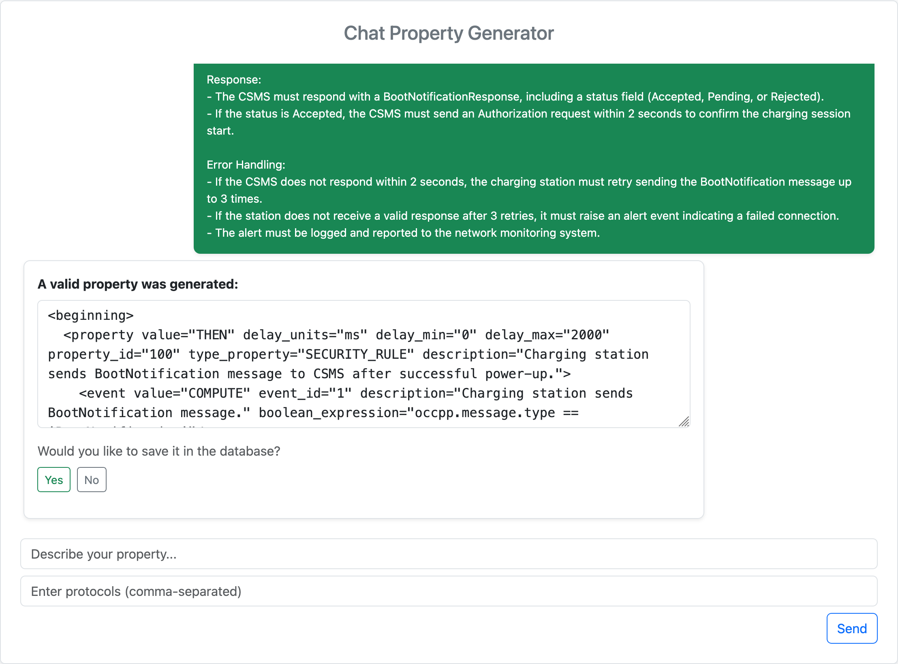

# Database Setup
This project requires a PostgreSQL database with two tables: `mmt_properties` and `protocols`. Follow the steps below to set up your database environment.

## Prerequisites
- PostgreSQL installed on your system.
- Database creation privileges.
- Node v20.19.2 (Only needed for web interface)

## Setup Instructions
1. **Create a new PostgreSQL database** for the project:

```sql
CREATE DATABASE <your_database_name>;
```

2. **Connect to the newly created database** using `psql`:

```bash
psql -d <your_database_name>
```

Or, if you're already inside `psql`:
```sql
\c <your_database_name>
```

3. **Create the required tables** by executing the following SQL statements:
```sql
-- Create mmt_properties table
CREATE TABLE mmt_properties(
    id SERIAL PRIMARY KEY,
    description text,
    protocol text,
    xml_content text NOT NULL,
    created_at TIMESTAMP DEFAULT CURRENT_TIMESTAMP,
    name text UNIQUE
);

-- Create protocols table
CREATE TABLE protocols(
    id SERIAL PRIMARY KEY,
    name text NOT NULL UNIQUE,
    attributes jsonb NOT NULL
);
```

## Table Descriptions

### `mmt_properties`
Stores formally defined properties used for monitoring.

| Column        | Type      | Description                                                                                    |
|---------------|-----------|------------------------------------------------------------------------------------------------|
| `id`          | SERIAL    | Auto-generated primary key.                                                                    |
| `description` | TEXT      | A description of the scenario represented by the XML  (e.g., what the property is monitoring). |
| `protocol`    | TEXT      | Names of the protocols associated with the property, separated by commas (e.g., `ocpp, mqtt`). |
| `xml_content` | TEXT      | The XML content defining the formal property.                                                  |
| `created_at`  | TIMESTAMP | Automatically set when the property is added.                                                  |
| `name`        | TEXT      | The filename (or unique name) representing the property. Must be unique.                       |

### `protocols`
Stores protocol names and their attribute definitions as used by MMT.

| Column       | Type   | Description                                                                  |
|--------------|--------|------------------------------------------------------------------------------|
| `id`         | SERIAL | Auto-generated primary key.                                                  |
| `name`       | TEXT   | The name of the protocol (e.g., `ocpp`). Must be unique.                     |
| `attributes` | JSONB  | A JSON object describing the protocol’s attributes and their meanings/types. |

## Environment Variables
To connect to the PostgreSQL database, create a `.env` file in the root directory of the project with the following variables:

```env
DB_NAME=your_database_name
DB_USER=your_username
DB_PASSWORD=your_password
DB_HOST=localhost
DB_PORT=5432
```

# LLM Setup using Ollama
This project uses a local Large Language Model (LLM) served by [Ollama](https://ollama.com/) to process and reason about scenario property generation.

## Prerequisites
- [Ollama](https://ollama.com/) installed and running on your machine.
- A supported model pulled (e.g., `mistral`, `llama2`, etc).

# Project Structure
This project is organized into the following directories and files:
```
project-root/
├── notebooks/
│   └── generate_property.ipynb        # Jupyter notebook for running and testing experiments
├── src/
│   ├── data/
│       └── mmt-property-context.txt   # Static context describing the MMT XML property format
│   ├── generate_prompt.py             # Builds few-shot prompts using scenario, examples, and protocol context
│   ├── generator.py                   # User-LLM interaction wrapper
│   ├── llm_interaction.py             # Interacts with the LLM to generate and validate XML properties
│   ├── retrieve_data.py               # Connects to PostgreSQL to retrieve protocol and example data
│   ├── syntax_validation.py           # Validates XML structure and content according to MMT rules
│   ├── save_property.py               # Connects to PostgreSQL and stores new property
│   └── utils.py                       # Utility functions (e.g., XML extraction)
├── tasks/
│   └── 1.txt ... 5.txt                # Text files containing example scenarios for OCPP
├── generated_prompts/
│   └── task_X_examples_Y.txt          # Prompt used for scenario X with Y examples
├── results/
│   └── <model_name>/
│       ├──── task_X_examples_Y/       # Folder for each scenario/shot configuration results
│       └──── stats_<model_name>.csv   # Summary of performance per model
├── chat-ui/                           # Web interface project
├── backend/                           # Backend used for web version
├── requirements.txt                   # Python dependencies
└── .env                               # (Not tracked) Environment variables for DB config
```

## Experiments Outputs

### `results/`
Contains the logged results of each model's output for every scenario tested.

- Each subfolder is named after a model (e.g., `deepseek-coder:6.7b`).
- Inside each model folder:
    - Each `task_X_examples_Y/` folder corresponds to a scenario (`task_X`) run with Y example properties.
    - Each folder contains:
        - All LLM responses (whether valid or not), one per iteration.
        - The final valid XML file (if generated).
        - Intermediate invalid XMLs or textual outputs.
- A CSV file (e.g., `stats_deepseek-coder:6.7b.csv`) summarizes:
    - Number of iterations per scenario.
    - Validity of the result
    - Time taken per run

### `generated_prompts/`
Contains the actual prompts given to the LLM during the experiments.

- File format: `task_X_examples_Y.txt`, where:
    - `X` is the task/scenario number (from `tasks/`)
    - `Y` is the number of few-shot examples used (1, 5, or 7)

## How the Components Work Together
1. **Scenarios** (in `tasks/`) describe use cases to generate properties for.
2. `retrieve_data.py` connects to your PostgreSQL DB to get:
    - Relevant examples (from `mmt_properties`)
    - Protocol context (from `protocols`)
3. `generate_prompt.py` builds a full prompt for the LLM using:
    - The scenario
    - Protocol definitions
    - Example property structure (`data/mmt-property-context.txt`)
4. `llm_interaction.py` sends the prompt to the LLM (via Ollama), then:
    - Extracts the XML
    - Validates it using `syntax_validation.py`
    - Iterates until a valid result or limit is reached.
5. The **Jupyter notebook** (`generate_property.ipynb`) ties it all together for interactive testing.

# Running the Web Version
In addition to the Jupyter-based workflow, this project provides a web-based interface that allows users to describe a scenario in natural language and receive a generated XML property through a chat interaction.

## Features
- Interactive chat interface built with React and Bootstrap.
- Backend implemented with FastAPI to serve generation requests.
- Messages from the AI include editable XML properties, validation feedback, and optional database saving.
- Automatically tracks user edits and saves them into the database if confirmed.

## Running the Web Version

### Backend (FastAPI)
Make sure your PostgreSQL and `.env` file properly configured, the use of a virtul environment is recommended:
```bash
cd backend
python3 -m venv venv
source venv/bin/activate
pip install -r requirements.txt

#Run FastAPI ap using the virtualenv uvicorn
venv/bin/uvicorn main:app --reload
```
The API will be available at `http://localhost:8000` and you can access the API documentation at `http://localhost:8000/docs`.

To change the LLM model that the backend is using, modify `src/generator.py`

### Frontend (React)

From the root or `chat-ui/` directory:
```bash
cd chat-ui
npm install
npm run dev
```
The frontend should be available at `http://localhost:5173` and will communicate with the backend for property generation and storage.


# Getting Started
1. Set up your PostgreSQL database and `.env` file (see above).
2. Pull a supported model (e.g. `mistral`) with Ollama.
3. Run the notebook `notebooks/generate_property.ipynb` to generate and validate properties.
4. Optionally add or edit scenarios in `tasks/`.