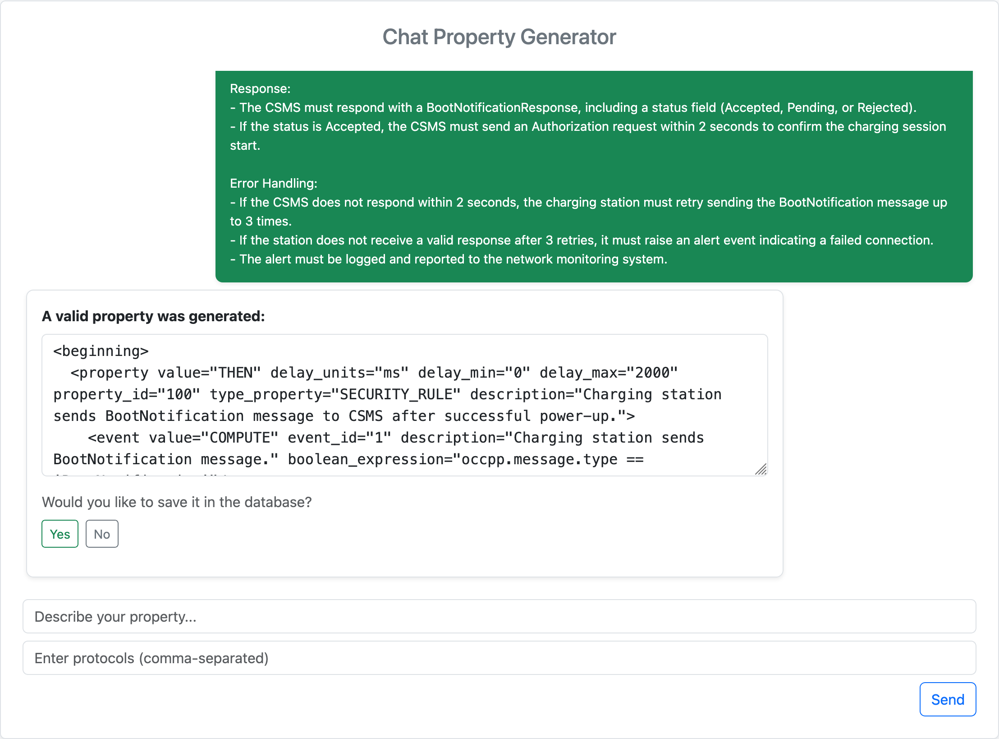

# LLM-based Property Generation
This project focuses on the automated generation of formal event-based XML properties from natural language descriptions using Large Language Models (LLMs). It also provides a web-based interface, database storage, and integration with monitoring tools for deploying generated properties.

The system supports:
- Property generation from user input (chat interface)
- Property generation ffrom incoming remote events (MISP-like format)
- Validation and iterative refinement of XML properties
- Storage of properties in a PostgreSQL database
- Deployment of properties to a monitoring tool (e.g., MMT-Security)

## Project Structure
This project is organized into the following directories and files:
```
project-root/
├── 5G_prompts/                        # Generated prompts for 5G scenarios
├── 5G_results/                        # Experimental results per model/scenario
├── 5G_stats/                          # Aggregated statistics
├── 5G_tasks/                          # Scenario descriptions (5G network scenarios)
│
├── backend/                           # FastAPI backend (web + APIs)
│   ├── main.py                        # API entry point
│   ├── models.py                      # Request/response models
│   └── requirements                   # Backend dependencies
│
├── chat-ui/                           # React frontend
│
├── src/                               # Core logic (LLM + processing)
│   ├── data/
│       └── mmt-property-context.txt
│   ├── experiments.py
│   ├── generate_prompt.py           
│   ├── generator.py                   
│   ├── llm_interaction.py             
│   ├── retrieve_data.py
│   ├── save_property.py 
│   ├── stats.py             
│   ├── syntax_validation.py     
│   └── utils.py
│
├── notebooks/
│   └── generate_property.ipynb       
└── .env                               # (Not tracked) Environment variables for DB config
```

## Database Setup
This project requires a PostgreSQL database with two tables: `mmt_properties` and `protocols`. Follow the steps below to set up your database environment.

## Prerequisites
- PostgreSQL installed on your system.
- Database creation privileges.
- Node v20.19.2 (for frontend)

## Setup Instructions
1. **Create a new PostgreSQL database** for the project:

```sql
CREATE DATABASE <your_database_name>;
```

2. **Connect to the newly created database** using `psql`:

```bash
psql -d <your_database_name>
```

Or, if you're already inside `psql`:
```sql
\c <your_database_name>
```

3. **Create the required tables** by executing the following SQL statements:
```sql
-- Create mmt_properties table
CREATE TABLE mmt_properties(
    id SERIAL PRIMARY KEY,
    description text,
    protocol text,
    xml_content text NOT NULL,
    created_at TIMESTAMP DEFAULT CURRENT_TIMESTAMP,
    name text UNIQUE
);

-- Create protocols table
CREATE TABLE protocols(
    id SERIAL PRIMARY KEY,
    name text NOT NULL UNIQUE,
    attributes jsonb NOT NULL
);
```

### Table Descriptions

`mmt_properties`: Stores formally defined properties used for monitoring.

| Column        | Type      | Description                                                                                    |
|---------------|-----------|------------------------------------------------------------------------------------------------|
| `id`          | SERIAL    | Auto-generated primary key.                                                                    |
| `description` | TEXT      | A description of the scenario represented by the XML  (e.g., what the property is monitoring). |
| `protocol`    | TEXT      | Names of the protocols associated with the property, separated by commas (e.g., `ocpp, mqtt`). |
| `xml_content` | TEXT      | The XML content defining the formal property.                                                  |
| `created_at`  | TIMESTAMP | Automatically set when the property is added.                                                  |
| `name`        | TEXT      | The filename (or unique name) representing the property. Must be unique.                       |

`protocols`: Stores protocol names and their attribute definitions as used by MMT.

| Column       | Type   | Description                                                                  |
|--------------|--------|------------------------------------------------------------------------------|
| `id`         | SERIAL | Auto-generated primary key.                                                  |
| `name`       | TEXT   | The name of the protocol (e.g., `ocpp`). Must be unique.                     |
| `attributes` | JSONB  | A JSON object describing the protocol’s attributes and their meanings/types. |

## Environment Variables
To connect to the PostgreSQL database, create a `.env` file in the root directory of the project with the following variables:

```env
DB_NAME=your_database_name
DB_USER=your_username
DB_PASSWORD=your_password
DB_HOST=localhost
DB_PORT=5432
```

## LLM Setup using Ollama
This project uses a local Large Language Model (LLM) served by [Ollama](https://ollama.com/) to process and reason about scenario property generation.

### Prerequisites
- [Ollama](https://ollama.com/) installed and running on your machine.
- A supported model pulled (e.g., `mistral`, `llama2`, etc).

## Core Workflow: Property generation pipeline
1. A scenario is provided (via notebook, API, or remote event)
2. `retrieve_data.py` fetches protocol definitions, example properties
3. `generate_prompt.py` builds a few-shot prompt
4. `llm_interaction.py` sends prompt to LLM, extracts XML, and validates syntax
5. Iteration continues until a valid property is generated or max attempts is reached
6. Results can be returned to the user, stored in DB, or sent to monitoring tool.

## Web Application
It features:
- Chat-based property generation
- Editable XML properties
- Validation feedback for invalid properties
- Save properties to database
- Send properties to monitoring tools
- Automatic handling for incoming remote events
- Background processing for event-driven generation

## Running the Web Version

### Backend (FASTAPI)
Make sure your PostgreSQL and `.env` file are properly configured, the use of a virtul environment is recommended:
```bash
cd backend
python3 -m venv venv
source venv/bin/activate
pip install -r requirements.txt

#Run FastAPI ap using the virtualenv uvicorn
venv/bin/uvicorn main:app --reload
```
The API will be available at `http://localhost:8000` and you can access the API documentation at `http://localhost:8000/docs`.

To change the LLM model that the backend is using, modify `src/generator.py`

### Frontend (React + Vite)
```bash
cd chat-ui
npm install
npm run dev
```
The frontend should be available at `http://localhost:5173` and will communicate with the backend for property generation and storage.

### Sending properties to monitoring
The backend exposes
```
POST /send-to-monitoring
```
This sends XML properties to an external monitoring receiver.
Response includes status, receiver response, error details (if any)

### Receiving Remote Events
The system supports ingestion of external events (MISP-like format):
```
POST /receive-event
```

## Experiments
### 5G Scenario Evaluation
- `5G_tasks/`: scenario descriptions
- `5G_prompts/`: generated outputs
- `5G_results/`: model outputs
- `5G_stats/`: aggregated metrics

# Getting Started
1. Set up your PostgreSQL database and `.env` file (see above).
2. Intall Ollama and pull a model
3. Run backend
4. Run frontend
5. Open UI and start generating properties

Optional:
- Use notebook for experiments
- Send remote events to trigger automatic generation